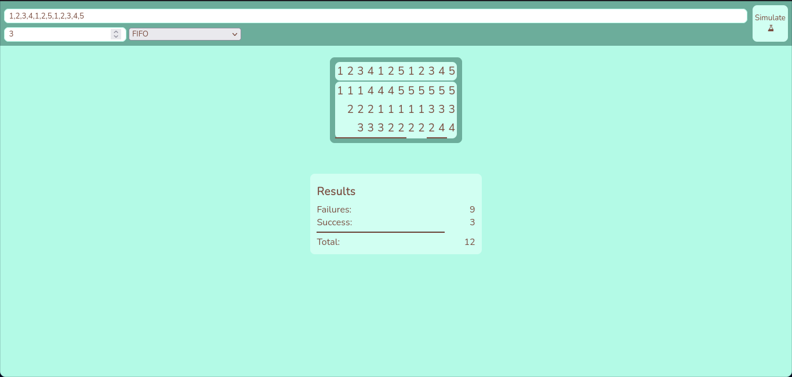

# pagination-algorithms

This is a simulator of pagination algorithms. In this small simulator you can add a string separated by commas to created tables that show you the result of that string simulated just like if were a set of orders to your CPU

This version also allow users to detect "Belamy anomaly", which is a special case in which resources are used worse that if fewer resources were avalible

